# Newsletter Automation

A Python workflow that turns a large stream of articles into a smaller, organized briefing for an AI-assisted newsletter draft.

I built the original version to reduce the repetitive work of checking feeds, removing duplicates, sorting stories, resolving article links, and assembling source material. This public version uses fictional sample data and generic editorial guidance. My private writing examples, voice rules, prompts, feed list, drafts, extracted articles, and publication files are not included.

## What it does

1. Collects stories from configured RSS feeds or a JSON fixture.
2. Cleans titles and removes duplicate links and near-identical titles.
3. Classifies stories into news, take-action, local-spotlight, and general-update buckets.
4. Selects a fixed number of unique candidates across sections.
5. Optionally follows redirects and extracts article text with Trafilatura or Beautiful Soup.
6. Builds a Markdown prompt pack with sources, metadata, generic instructions, and clear section requirements.

The workflow stops at the review boundary. It does not publish a newsletter, and this public version does not call an LLM API. A person can review the selected sources before using the prompt pack with an AI writing tool.

```mermaid
flowchart LR
  Sources[RSS feeds or JSON fixture] --> Clean[Normalize and deduplicate]
  Clean --> Classify[Rule-based classification]
  Classify --> Select[Unique candidate selection]
  Select --> Extract[Optional article extraction]
  Extract --> Pack[Markdown prompt pack]
  Pack --> Review[Human source review]
  Review --> AI[AI-assisted draft]
```



## Run the fictional demo

The demo uses invented headlines and URLs and does not need network access or third-party packages.

```sh
python3 src/newsletter_pipeline.py \
  --config examples/config.json \
  --input examples/stories.json \
  --output build/demo-prompt-pack.md
```

The command prints selection counts and writes the generated prompt pack to `build/`, which is ignored by Git.

## Run with RSS feeds

Create a private copy of `examples/config.json`, add feed URLs, and install the optional live-source dependencies:

```sh
python3 -m pip install -r requirements.txt
python3 src/newsletter_pipeline.py \
  --config path/to/private-config.json \
  --output build/live-prompt-pack.md \
  --full-text
```

Respect publisher terms, robots policies, copyrights, and rate limits. Full-text extraction can fail on paywalls or JavaScript-heavy pages, so the output records the source link and the failure instead of pretending an article was reviewed.

## Design choices

- Classification is deterministic and inspectable. It is useful for narrowing candidates, not judging truth or importance.
- A story can enter several buckets, but final selection prevents the same link from appearing twice.
- Missing or weak article extraction is visible in the output.
- Editorial guidance is loaded from files, keeping private voice material outside application code.
- Generated prompt packs are ignored because they may contain copyrighted article text or private editorial material.

## Tests

```sh
python3 -m unittest discover -s tests -v
```

The tests cover title filtering, duplicate removal, classification, unique selection, and prompt-pack rendering using fictional inputs.

## Privacy boundary

The repository intentionally excludes:

- original newsletters and writing samples;
- personal voice rules and production prompts;
- private feed lists and publication strategy;
- generated drafts and prompt packs;
- downloaded or extracted article content;
- credentials, subscriber information, analytics, and workflow state.

The public repository was created from selected, sanitized code with a new Git history. It is a portfolio demonstration, not a release of the private publication workspace.
